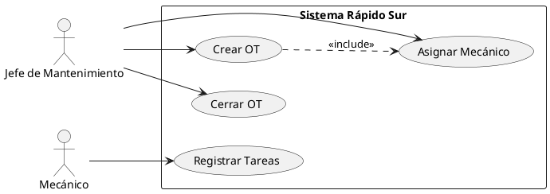
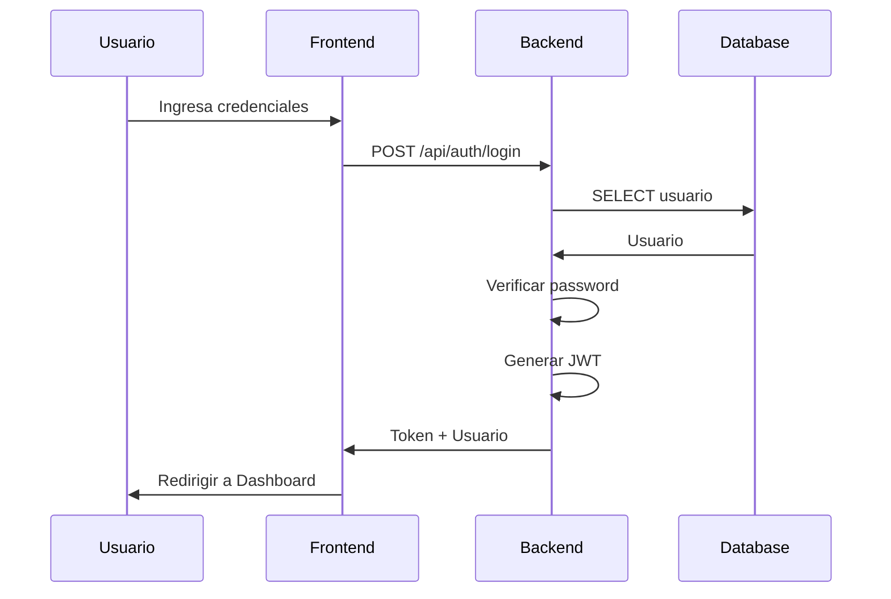

# DIAGRAMAS DEL SISTEMA

## Sistema de Gestión de Mantenimiento Vehicular - Rápido Sur

---

**Versión del Sistema**: 1.0
**Fecha**: Diciembre 2025
**Audiencia**: Desarrolladores, Arquitectos, Equipo técnico

---

## Tabla de Contenidos

1. [Introducción](#1-introducción)
2. [Diagrama de Arquitectura](#2-diagrama-de-arquitectura)
3. [Diagrama de Componentes](#3-diagrama-de-componentes)
4. [Diagrama Entidad-Relación (ER)](#4-diagrama-entidad-relación-er)
5. [Diagramas de Casos de Uso](#5-diagramas-de-casos-de-uso)
6. [Diagramas de Secuencia](#6-diagramas-de-secuencia)
7. [Diagrama de Flujo de Datos](#7-diagrama-de-flujo-de-datos)
8. [Diagrama de Estados](#8-diagrama-de-estados)
9. [Diagrama de Deployment](#9-diagrama-de-deployment)

---

## 1. Introducción

Este documento contiene todos los diagramas arquitectónicos y de diseño del Sistema de Gestión de Mantenimiento Vehicular de Rápido Sur.

### 1.1 Notación Utilizada

Los diagramas utilizan principalmente:

- **UML** (Unified Modeling Language) para casos de uso, secuencia, y componentes
- **Chen notation** para el diagrama ER
- **C4 Model** para arquitectura
- **PlantUML/Mermaid** - Formato textual que puede convertirse a imágenes

### 1.2 Herramientas Recomendadas

Para visualizar o editar estos diagramas:

- **PlantUML**: <https://plantuml.com>
- **Mermaid Live Editor**: <https://mermaid.live>
- **Draw.io**: <https://app.diagrams.net>
- **Lucidchart**: <https://www.lucidchart.com>

---

## 2. Diagrama de Arquitectura

### 2.1 Arquitectura General (Vista C4 - Nivel 1: Contexto)

```
┌──────────────────────────────────────────────────────────────────────┐
│                         CONTEXTO DEL SISTEMA                          │
└──────────────────────────────────────────────────────────────────────┘

                          ┌─────────────┐
                          │             │
                          │  USUARIOS   │
                          │             │
                          │ - Admin     │
                          │ - Jefe Mant │
                          │ - Mecánicos │
                          │             │
                          └──────┬──────┘
                                 │
                                 │ HTTPS
                                 │
                                 ▼
        ┌────────────────────────────────────────────────┐
        │                                                │
        │  SISTEMA DE GESTIÓN DE MANTENIMIENTO           │
        │  VEHICULAR - RÁPIDO SUR                       │
        │                                                │
        │  - Gestión de flotas                           │
        │  - Órdenes de trabajo                          │
        │  - Alertas preventivas                         │
        │  - Control de inventario                       │
        │  - Reportes y análisis                         │
        │                                                │
        └────────┬──────────────────────┬────────────────┘
                 │                      │
                 │                      │
                 ▼                      ▼
        ┌────────────────┐    ┌────────────────┐
        │                │    │                │
        │  SERVIDOR      │    │  PROVEEDOR     │
        │  SMTP          │    │  EMAIL         │
        │  (Gmail/       │    │  (Opcional)    │
        │   SendGrid)    │    │                │
        │                │    │                │
        └────────────────┘    └────────────────┘

        Envío de alertas      Notificaciones
        diarias               adicionales
```

### 2.2 Arquitectura de Contenedores (Vista C4 - Nivel 2)

```
┌───────────────────────────────────────────────────────────────────────┐
│                      ARQUITECTURA DE CONTENEDORES                      │
└───────────────────────────────────────────────────────────────────────┘


     ┌──────────────────────┐
     │   NAVEGADOR WEB      │
     │   (Cliente)          │
     └──────────┬───────────┘
                │
                │ HTTPS (443)
                │ REST API (JSON)
                │
                ▼
     ┌──────────────────────┐
     │                      │
     │  CONTENEDOR FRONTEND │
     │                      │
     │  Next.js 15          │
     │  React 18            │
     │  Tailwind CSS        │
     │  Nginx (producción)  │
     │                      │
     │  Puerto: 80/443      │
     │                      │
     └──────────┬───────────┘
                │
                │ HTTP (3000)
                │ /api/*
                │
                ▼
     ┌──────────────────────┐
     │                      │
     │  CONTENEDOR BACKEND  │
     │                      │
     │  NestJS 10           │
     │  Node.js 20 LTS      │
     │  TypeScript 5        │
     │  JWT Auth            │
     │                      │
     │  Puerto: 3000        │
     │                      │
     └──────────┬───────────┘
                │
                │ PostgreSQL Protocol (5432)
                │
                ▼
     ┌──────────────────────┐
     │                      │
     │  CONTENEDOR DATABASE │
     │                      │
     │  PostgreSQL 15       │
     │  TypeORM             │
     │                      │
     │  Puerto: 5432        │
     │  (solo red interna)  │
     │                      │
     └──────────────────────┘


     Todo orquestado con:
     - Docker Compose
     - Dokploy (gestión)
```

### 2.3 Arquitectura N-Tier (3 Capas)

```
┌─────────────────────────────────────────────────────────────┐
│                    ARQUITECTURA N-TIER                       │
└─────────────────────────────────────────────────────────────┘

┌─────────────────────────────────────────────────────────────┐
│                  CAPA DE PRESENTACIÓN                        │
│  (Frontend - Next.js + React)                                │
│  ┌─────────────────────────────────────────────────────┐   │
│  │  Componentes React                                   │   │
│  │  - DashboardAdmin, DashboardJefe, DashboardMecanico │   │
│  │  - VehiculosList, VehiculoForm                      │   │
│  │  - OrdenTrabajoList, OrdenTrabajoDetail             │   │
│  │  - ReportesCostos, ReportesDisponibilidad           │   │
│  ├─────────────────────────────────────────────────────┤   │
│  │  Context API (Estado Global)                        │   │
│  │  - AuthContext (usuario, token, rol)                │   │
│  ├─────────────────────────────────────────────────────┤   │
│  │  Services (API Client)                              │   │
│  │  - authService.ts                                   │   │
│  │  - vehiculosService.ts                              │   │
│  │  - ordenesService.ts                                │   │
│  └─────────────────────────────────────────────────────┘   │
└─────────────────────────────────────────────────────────────┘
                             │
                             │ HTTP REST API (JSON)
                             │
┌────────────────────────────▼────────────────────────────────┐
│                  CAPA DE LÓGICA DE NEGOCIO                   │
│  (Backend - NestJS)                                          │
│  ┌─────────────────────────────────────────────────────┐   │
│  │  Controllers (Endpoints REST)                        │   │
│  │  - auth.controller.ts → POST /api/auth/login        │   │
│  │  - vehiculos.controller.ts → CRUD /api/vehiculos    │   │
│  │  - ordenes.controller.ts → CRUD /api/ordenes        │   │
│  │  - reportes.controller.ts → GET /api/reportes/*     │   │
│  ├─────────────────────────────────────────────────────┤   │
│  │  Guards & Middleware                                 │   │
│  │  - JwtAuthGuard (autenticación)                     │   │
│  │  - RolesGuard (autorización RBAC)                   │   │
│  ├─────────────────────────────────────────────────────┤   │
│  │  Services (Lógica de Negocio)                       │   │
│  │  - auth.service.ts (login, JWT)                     │   │
│  │  - vehiculos.service.ts (CRUD, alertas)             │   │
│  │  - ordenes.service.ts (flujo OT, cierre, costos)    │   │
│  │  - alertas.service.ts (cron job, emails)            │   │
│  │  - reportes.service.ts (generación, cálculos)       │   │
│  ├─────────────────────────────────────────────────────┤   │
│  │  Repositories (Acceso a Datos)                      │   │
│  │  - @InjectRepository(Usuario)                       │   │
│  │  - @InjectRepository(Vehiculo)                      │   │
│  │  - @InjectRepository(OrdenTrabajo)                  │   │
│  └─────────────────────────────────────────────────────┘   │
└─────────────────────────────────────────────────────────────┘
                             │
                             │ TypeORM (SQL)
                             │
┌────────────────────────────▼────────────────────────────────┐
│                    CAPA DE DATOS                             │
│  (PostgreSQL + TypeORM)                                      │
│  ┌─────────────────────────────────────────────────────┐   │
│  │  Base de Datos Relacional                           │   │
│  │                                                       │   │
│  │  Tablas:                                             │   │
│  │  - usuarios (RBAC)                                   │   │
│  │  - vehiculos                                         │   │
│  │  - ordenes_trabajo                                   │   │
│  │  - tareas                                            │   │
│  │  - repuestos                                         │   │
│  │  - detalles_repuestos                                │   │
│  │  - planes_preventivos                                │   │
│  │  - alertas                                           │   │
│  │                                                       │   │
│  │  Normalización: 3FN                                  │   │
│  │  Integridad: Foreign Keys, Constraints              │   │
│  └─────────────────────────────────────────────────────┘   │
└─────────────────────────────────────────────────────────────┘
```

---

## 3. Diagrama de Componentes

### 3.1 Componentes del Backend (NestJS)

```
┌──────────────────────────────────────────────────────────────┐
│                  BACKEND - MÓDULOS NESTJS                     │
└──────────────────────────────────────────────────────────────┘

                         ┌───────────────┐
                         │  AppModule    │
                         │  (Raíz)       │
                         └───────┬───────┘
                                 │
                 ┌───────────────┼───────────────┐
                 │               │               │
        ┌────────▼────────┐ ┌───▼────┐ ┌────────▼────────┐
        │  AuthModule     │ │  Common │ │  DatabaseModule │
        │                 │ │  Module │ │  (TypeORM)      │
        │ - Login/JWT     │ │         │ │                 │
        │ - Guards        │ │ -Guards │ │  Conexión a     │
        │ - Strategies    │ │ -Pipes  │ │  PostgreSQL     │
        │                 │ │ -Decorat│ │                 │
        └─────────────────┘ └─────────┘ └─────────────────┘


┌─────────────────────────────────────────────────────────────────┐
│                       MÓDULOS DE NEGOCIO                         │
└─────────────────────────────────────────────────────────────────┘

┌──────────────┐  ┌──────────────┐  ┌──────────────┐
│  UsersModule │  │ VehiclesModul│  │WorkOrdersModul│
│              │  │              │  │               │
│ - Controller │  │ - Controller │  │ - Controller  │
│ - Service    │  │ - Service    │  │ - Service     │
│ - Entity     │  │ - Entity     │  │ - Entity      │
│ - Repository │  │ - Repository │  │ - Repository  │
│              │  │              │  │               │
│ Gestión de   │  │ CRUD de      │  │ Core del      │
│ usuarios y   │  │ vehículos    │  │ sistema:      │
│ roles RBAC   │  │ y kilometraje│  │ - Crear OT    │
│              │  │              │  │ - Asignar     │
│              │  │              │  │ - Cerrar      │
└──────────────┘  └──────────────┘  └──────────────┘

┌──────────────┐  ┌──────────────┐  ┌──────────────┐
│ TasksModule  │  │  PartsModule │  │PartDetailsModul│
│              │  │              │  │               │
│ - Controller │  │ - Controller │  │ - Controller  │
│ - Service    │  │ - Service    │  │ - Service     │
│ - Entity     │  │ - Entity     │  │ - Entity      │
│ - Repository │  │ - Repository │  │ - Repository  │
│              │  │              │  │               │
│ Tareas dentro│  │ Catálogo de  │  │ Many-to-many  │
│ de OT        │  │ repuestos e  │  │ Tareas ↔      │
│              │  │ inventario   │  │ Repuestos     │
└──────────────┘  └──────────────┘  └──────────────┘

┌──────────────┐  ┌──────────────┐  ┌──────────────┐
│PreventivePlans│  │ AlertsModule │  │ReportsModule │
│   Module     │  │              │  │              │
│              │  │ - Controller │  │ - Controller │
│ - Controller │  │ - Service    │  │ - Service    │
│ - Service    │  │ - Entity     │  │              │
│ - Entity     │  │ - Repository │  │ Generación de│
│ - Repository │  │              │  │ reportes:    │
│              │  │ Cron job     │  │ - Costos     │
│ Config de    │  │ diario (6AM) │  │ - Tiempo     │
│ mantenimiento│  │ Emails auto  │  │ - Disponibil │
│ preventivo   │  │              │  │ - Export CSV │
└──────────────┘  └──────────────┘  └──────────────┘


DEPENDENCIAS ENTRE MÓDULOS:

WorkOrdersModule
   ├─> VehiclesModule (vehiculo de la OT)
   ├─> UsersModule (mecánico asignado)
   └─> TasksModule (tareas de la OT)

TasksModule
   ├─> UsersModule (mecánico de la tarea)
   └─> PartDetailsModule (repuestos usados)

PartDetailsModule
   ├─> TasksModule (tarea)
   └─> PartsModule (repuesto)

AlertsModule
   ├─> VehiclesModule (vehículo alertado)
   └─> PreventivePlansModule (plan preventivo)

ReportsModule
   ├─> WorkOrdersModule (datos de OT)
   ├─> VehiclesModule (datos de vehículos)
   └─> UsersModule (usuario que genera reporte)
```

### 3.2 Componentes del Frontend (React)

```
┌──────────────────────────────────────────────────────────────┐
│                  FRONTEND - COMPONENTES REACT                 │
└──────────────────────────────────────────────────────────────┘

src/
├── App.tsx (Raíz)
│
├── components/
│   ├── Layout/
│   │   ├── Navbar.tsx              (Barra superior)
│   │   ├── Sidebar.tsx             (Menú lateral)
│   │   └── Footer.tsx              (Pie de página)
│   │
│   ├── Auth/
│   │   ├── LoginForm.tsx           (Formulario login)
│   │   ├── ProtectedRoute.tsx      (HOC para rutas protegidas)
│   │   └── RoleGuard.tsx           (Guard por rol)
│   │
│   ├── Vehiculos/
│   │   ├── VehiculosList.tsx       (Tabla de vehículos)
│   │   ├── VehiculoForm.tsx        (Crear/editar vehículo)
│   │   ├── VehiculoDetail.tsx      (Detalle + historial)
│   │   └── PlanPreventivoForm.tsx  (Config plan)
│   │
│   ├── OrdenesT rabajo/
│   │   ├── OrdenTrabajoList.tsx    (Lista de OT)
│   │   ├── OrdenTrabajoForm.tsx    (Crear OT)
│   │   ├── OrdenTrabajoDetail.tsx  (Detalle completo)
│   │   ├── AsignarMecanico.tsx     (Modal asignación)
│   │   └── CerrarOT.tsx            (Modal cierre)
│   │
│   ├── Tareas/
│   │   ├── TareaForm.tsx           (Agregar tarea)
│   │   ├── TareasList.tsx          (Lista en OT)
│   │   └── TareaItem.tsx           (Item individual)
│   │
│   ├── Repuestos/
│   │   ├── RepuestosList.tsx       (Catálogo)
│   │   ├── RepuestoForm.tsx        (Agregar repuesto)
│   │   ├── RepuestoSelector.tsx    (Selector en tarea)
│   │   └── StockBadge.tsx          (Badge de stock)
│   │
│   ├── Alertas/
│   │   ├── AlertasList.tsx         (Lista de alertas)
│   │   └── AlertaCard.tsx          (Card individual)
│   │
│   ├── Reportes/
│   │   ├── ReporteCostos.tsx       (Reporte de costos)
│   │   ├── ReporteDisponibilidad.tsx
│   │   ├── ReporteTiempos.tsx
│   │   └── ExportCSVButton.tsx     (Botón exportar)
│   │
│   └── Common/
│       ├── Button.tsx              (Botón reutilizable)
│       ├── Input.tsx               (Input reutilizable)
│       ├── Table.tsx               (Tabla reutilizable)
│       ├── Modal.tsx               (Modal reutilizable)
│       ├── Spinner.tsx             (Loading)
│       └── ErrorBoundary.tsx       (Manejo de errores)
│
├── pages/
│   ├── LoginPage.tsx               (Página de login)
│   ├── DashboardPage.tsx           (Dashboard por rol)
│   ├── VehiculosPage.tsx           (Gestión de vehículos)
│   ├── OrdenesTrabajoPage.tsx      (Gestión de OT)
│   ├── AlertasPage.tsx             (Alertas pendientes)
│   ├── RepuestosPage.tsx           (Catálogo de repuestos)
│   ├── UsuariosPage.tsx            (Gestión de usuarios - Admin)
│   └── ReportesPage.tsx            (Reportes)
│
├── context/
│   ├── AuthContext.tsx             (Usuario, token, login, logout)
│   └── ThemeContext.tsx            (Tema claro/oscuro - futuro)
│
├── services/
│   ├── api.ts                      (Axios instance)
│   ├── authService.ts              (Login, refresh token)
│   ├── vehiculosService.ts         (CRUD vehículos)
│   ├── ordenesService.ts           (CRUD órdenes)
│   ├── tareasService.ts            (CRUD tareas)
│   ├── repuestosService.ts         (CRUD repuestos)
│   ├── alertasService.ts           (GET alertas)
│   └── reportesService.ts          (Generar reportes)
│
├── hooks/
│   ├── useAuth.ts                  (Hook de autenticación)
│   ├── useVehiculos.ts             (Hook de vehículos)
│   ├── useOrdenesTrabajo.ts        (Hook de OT)
│   └── useReportes.ts              (Hook de reportes)
│
├── types/
│   ├── usuario.types.ts            (Interfaces de Usuario)
│   ├── vehiculo.types.ts           (Interfaces de Vehículo)
│   ├── ordenTrabajo.types.ts       (Interfaces de OT)
│   ├── tarea.types.ts              (Interfaces de Tarea)
│   └── repuesto.types.ts           (Interfaces de Repuesto)
│
└── utils/
    ├── formatters.ts               (Formateo de fechas, moneda)
    ├── validators.ts               (Validaciones de cliente)
    └── constants.ts                (Constantes)
```

---

## 4. Diagrama Entidad-Relación (ER)

### 4.1 Modelo ER Completo

```
┌──────────────────────────────────────────────────────────────────────┐
│                     MODELO ENTIDAD-RELACIÓN                           │
│                         (Notación Chen)                               │
└──────────────────────────────────────────────────────────────────────┘


┌─────────────┐                    ┌──────────────┐
│   USUARIO   │                    │   VEHÍCULO   │
├─────────────┤                    ├──────────────┤
│ PK id       │                    │ PK id        │
│    nombre   │                    │ UK patente   │
│ UK email    │                    │    marca     │
│    password │                    │    modelo    │
│    rol      │◄───┐          ┌───►│    anno      │
│    activo   │    │          │    │    km_actual │
└─────────────┘    │          │    │    estado    │
                   │          │    │    ultima_rev│
                   │  asigna  │    └──────────────┘
                   │    a     │           │
                   │          │           │ tiene
                   │          │           │  1:1
                   │          │           │
              ┌────┴──────────┴────┐      │
              │   ORDEN TRABAJO     │      │
              ├─────────────────────┤      │
              │ PK id               │      │
              │ UK numero_ot        │      │
              │ FK vehiculo_id      │◄─────┘
              │ FK mecanico_id      │
              │    tipo             │
              │    estado           │
              │    prioridad        │
              │    descripcion      │
              │    fecha_creacion   │
              │    fecha_cierre     │
              │    costo_total      │
              └──────────┬──────────┘
                         │
                         │ contiene
                         │   1:N
                         │
              ┌──────────▼──────────┐
              │      TAREA          │
              ├─────────────────────┤
              │ PK id               │
              │ FK orden_trabajo_id │
              │ FK mecanico_id      │
              │    descripcion      │
              │    completada       │
              │    horas_trabajadas │
              └──────────┬──────────┘
                         │
                         │ usa
                         │  M:N
                         │
          ┌──────────────▼─────────────┐
          │   DETALLE_REPUESTO         │
          ├────────────────────────────┤
          │ PK id                      │
          │ FK tarea_id                │
          │ FK repuesto_id             │
          │    cantidad_usada          │
          │    precio_unitario_momento │
          └──────────────┬─────────────┘
                         │
                         │
              ┌──────────▼──────────┐
              │     REPUESTO        │
              ├─────────────────────┤
              │ PK id               │
              │ UK codigo           │
              │    nombre           │
              │    precio_unitario  │
              │    cantidad_stock   │
              │    stock_minimo     │
              └─────────────────────┘


┌──────────────┐
│   VEHÍCULO   │
├──────────────┤
│ PK id        │
└──────┬───────┘
       │
       │ tiene
       │  1:1
       │
       ▼
┌─────────────────┐
│ PLAN_PREVENTIVO │
├─────────────────┤
│ PK id           │
│ FK vehiculo_id  │
│    tipo_interv  │
│    intervalo    │
│    proximo_km   │
│    proxima_fecha│
│    activo       │
└─────────────────┘


┌──────────────┐
│   VEHÍCULO   │
├──────────────┤
│ PK id        │
└──────┬───────┘
       │
       │ genera
       │  1:N
       │
       ▼
┌─────────────┐
│   ALERTA    │
├─────────────┤
│ PK id       │
│ FK vehiculo │
│    tipo     │
│    estado   │
│    mensaje  │
│    fecha_gen│
└─────────────┘
```

### 4.2 Cardinalidades y Relaciones

```
RELACIONES PRINCIPALES:

1. Usuario ─(asigna a)─> Orden Trabajo
   Cardinalidad: 1:N (Un mecánico puede tener muchas OT)
   Restricción: ON DELETE RESTRICT (no puede eliminarse un mecánico con OT asignadas)

2. Vehículo ─(tiene)─> Orden Trabajo
   Cardinalidad: 1:N (Un vehículo puede tener muchas OT a lo largo del tiempo)
   Restricción: ON DELETE RESTRICT

3. Orden Trabajo ─(contiene)─> Tarea
   Cardinalidad: 1:N (Una OT tiene muchas tareas)
   Restricción: ON DELETE RESTRICT

4. Tarea ─(usa)─> Repuesto
   Cardinalidad: M:N (Muchas tareas usan muchos repuestos)
   Tabla intermedia: detalle_repuesto
   Restricción: ON DELETE RESTRICT

5. Vehículo ─(tiene)─> Plan Preventivo
   Cardinalidad: 1:1 (Un vehículo tiene un plan preventivo activo)
   Restricción: ON DELETE RESTRICT

6. Vehículo ─(genera)─> Alerta
   Cardinalidad: 1:N (Un vehículo puede generar muchas alertas)
   Restricción: ON DELETE RESTRICT
```

### 4.3 Tipos de Datos Clave

```
TIPOS ENUMERADOS:

rol_usuario:
  - Administrador
  - JefeMantenimiento
  - Mecanico

estado_vehiculo:
  - Activo
  - EnMantenimiento
  - Inactivo
  - DeBaja

tipo_orden_trabajo:
  - Preventivo
  - Correctivo

estado_orden_trabajo:
  - Pendiente
  - Asignada
  - EnProgreso
  - Finalizada
  - Cancelada

prioridad_orden_trabajo:
  - BAJA
  - MEDIA
  - ALTA
  - CRITICA

tipo_intervalo:
  - KM (por kilometraje)
  - TIEMPO (por días)

tipo_alerta:
  - POR_KM
  - POR_TIEMPO
  - STOCK_BAJO

estado_alerta:
  - Pendiente
  - Resuelta
  - Ignorada
```

---

## 5. Diagramas de Casos de Uso

### 5.1 Casos de Uso por Actor

```
┌────────────────────────────────────────────────────────────────┐
│                     CASOS DE USO - GENERAL                      │
└────────────────────────────────────────────────────────────────┘


             Administrador          Jefe Mantenimiento          Mecánico
                  │                        │                       │
                  │                        │                       │
    ┌─────────────┼────────────────────────┼───────────────────────┼────────┐
    │             │                        │                       │        │
    │    ┌────────▼────────┐      ┌────────▼────────┐    ┌────────▼──────┐ │
    │    │ Gestionar       │      │ Crear Orden de  │    │ Ver Mis OT    │ │
    │    │ Usuarios        │      │ Trabajo         │    │ Asignadas     │ │
    │    └─────────────────┘      └─────────────────┘    └───────────────┘ │
    │                                     │                       │         │
    │    ┌─────────────────┐      ┌──────▼──────────┐    ┌───────▼───────┐ │
    │    │ Gestionar       │      │ Asignar Mecánico│    │ Registrar     │ │
    │    │ Vehículos       │      │ a OT            │    │ Tareas        │ │
    │    └─────────────────┘      └─────────────────┘    └───────────────┘ │
    │                                     │                       │         │
    │    ┌─────────────────┐      ┌──────▼──────────┐    ┌───────▼───────┐ │
    │    │ Gestionar       │      │ Cerrar Orden de │    │ Registrar     │ │
    │    │ Repuestos       │      │ Trabajo         │    │ Repuestos     │ │
    │    └─────────────────┘      └─────────────────┘    │ Usados        │ │
    │                                     │               └───────────────┘ │
    │    ┌─────────────────┐      ┌──────▼──────────┐           │         │
    │    │ Generar         │      │ Revisar Alertas │    ┌──────▼────────┐ │
    │    │ Reportes        │      │ Preventivas     │    │ Marcar Tareas │ │
    │    └─────────────────┘      └─────────────────┘    │ Completadas   │ │
    │                                     │               └───────────────┘ │
    │    ┌─────────────────┐      ┌──────▼──────────┐           │         │
    │    │ Exportar a CSV  │      │ Generar Reportes│    ┌──────▼────────┐ │
    │    └─────────────────┘      │ (limitados)     │    │ Notificar     │ │
    │                              └─────────────────┘    │ Finalización  │ │
    │                                                     └───────────────┘ │
    │                                                                       │
    │  ┌─────────────────────────────────────────────────────────────┐    │
    │  │ CASOS DE USO COMUNES A TODOS                                │    │
    │  │                                                               │    │
    │  │  • Iniciar Sesión                                            │    │
    │  │  • Cerrar Sesión                                             │    │
    │  │  • Cambiar Contraseña                                        │    │
    │  │  • Ver Perfil                                                │    │
    │  │  • Consultar Historial de Vehículo                           │    │
    │  └─────────────────────────────────────────────────────────────┘    │
    │                                                                       │
    │              SISTEMA DE GESTIÓN DE MANTENIMIENTO VEHICULAR           │
    └───────────────────────────────────────────────────────────────────────┘
```

### 5.2 Caso de Uso Detallado: Crear Orden de Trabajo

```
┌──────────────────────────────────────────────────────────────────┐
│  CASO DE USO: Crear Orden de Trabajo                            │
├──────────────────────────────────────────────────────────────────┤
│  Actor Principal: Jefe de Mantenimiento                          │
│  Objetivo: Crear una nueva OT preventiva o correctiva            │
│                                                                  │
│  FLUJO PRINCIPAL:                                                │
│                                                                  │
│  1. Jefe accede al módulo "Órdenes de Trabajo"                  │
│  2. Sistema muestra lista de OT existentes                       │
│  3. Jefe hace clic en "+ Nueva Orden de Trabajo"                │
│  4. Sistema muestra formulario de creación                       │
│  5. Jefe selecciona vehículo del selector                        │
│  6. Jefe selecciona tipo (Preventivo/Correctivo)                 │
│  7. Jefe ingresa descripción del trabajo                         │
│  8. Jefe opcionalmente selecciona prioridad                      │
│  9. Jefe hace clic en "Crear"                                    │
│ 10. Sistema valida datos ingresados                              │
│ 11. Sistema genera número único de OT (OT-2025-NNNNN)            │
│ 12. Sistema crea OT con estado "Pendiente"                       │
│ 13. Sistema muestra mensaje de éxito                             │
│ 14. Sistema redirige al detalle de la OT creada                  │
│                                                                  │
│  FLUJOS ALTERNATIVOS:                                            │
│                                                                  │
│  A1. En el paso 10, si la validación falla:                      │
│      - Sistema muestra mensajes de error                         │
│      - Usuario corrige datos                                     │
│      - Continúa en paso 9                                        │
│                                                                  │
│  A2. Crear OT desde una alerta:                                  │
│      - Jefe accede a "Alertas"                                   │
│      - Hace clic en "Crear OT" junto a una alerta                │
│      - Sistema pre-completa vehículo, tipo y descripción         │
│      - Continúa en paso 8                                        │
│                                                                  │
│  PRECONDICIONES:                                                 │
│  - Usuario autenticado con rol JefeMantenimiento                 │
│  - Existen vehículos registrados en el sistema                   │
│                                                                  │
│  POSTCONDICIONES:                                                │
│  - OT creada con número único                                    │
│  - OT en estado "Pendiente"                                      │
│  - OT visible en lista de OT                                     │
│  - Si fue desde alerta, la alerta cambia a "Resuelta"            │
└──────────────────────────────────────────────────────────────────┘
```

---

## 6. Diagramas de Secuencia

### 6.1 Secuencia: Login de Usuario

```
┌───────┐              ┌──────────┐            ┌─────────┐         ┌───────────┐
│Usuario│              │ Frontend │            │ Backend │         │PostgreSQL │
└───┬───┘              └────┬─────┘            └────┬────┘         └─────┬─────┘
    │                       │                       │                    │
    │ 1. Ingresa email      │                       │                    │
    │    y contraseña       │                       │                    │
    ├──────────────────────>│                       │                    │
    │                       │                       │                    │
    │ 2. Click "Iniciar     │                       │                    │
    │    Sesión"            │                       │                    │
    ├──────────────────────>│                       │                    │
    │                       │                       │                    │
    │                       │ 3. POST /api/auth/login                   │
    │                       │  {email, password}    │                    │
    │                       ├──────────────────────>│                    │
    │                       │                       │                    │
    │                       │                       │ 4. SELECT * FROM   │
    │                       │                       │    usuarios        │
    │                       │                       │    WHERE email=?   │
    │                       │                       ├───────────────────>│
    │                       │                       │                    │
    │                       │                       │ 5. Usuario         │
    │                       │                       │    encontrado      │
    │                       │                       │<───────────────────┤
    │                       │                       │                    │
    │                       │                       │ 6. bcrypt.compare  │
    │                       │                       │    (password,      │
    │                       │                       │     hash)          │
    │                       │                       │                    │
    │                       │                       │ 7. Generar JWT     │
    │                       │                       │    con payload:    │
    │                       │                       │    {id, email, rol}│
    │                       │                       │                    │
    │                       │ 8. 200 OK             │                    │
    │                       │  {access_token, user} │                    │
    │                       │<──────────────────────┤                    │
    │                       │                       │                    │
    │                       │ 9. Guardar token en   │                    │
    │                       │    localStorage       │                    │
    │                       │                       │                    │
    │                       │10. Actualizar         │                    │
    │                       │    AuthContext        │                    │
    │                       │                       │                    │
    │ 11. Redirigir a       │                       │                    │
    │     Dashboard         │                       │                    │
    │<──────────────────────┤                       │                    │
    │                       │                       │                    │
```

### 6.2 Secuencia: Crear y Cerrar Orden de Trabajo

```
┌──────┐   ┌────────┐   ┌───────┐   ┌──────┐   ┌────────┐   ┌──────┐
│ Jefe │   │Frontend│   │Backend│   │  DB  │   │Mecánico│   │Alerts│
└──┬───┘   └───┬────┘   └───┬───┘   └───┬──┘   └────┬───┘   └───┬──┘
   │            │            │           │           │           │
   │─ Crear OT ──>           │           │           │           │
   │            │            │           │           │           │
   │            │─POST /api/ordenes──>   │           │           │
   │            │  {vehiculo, tipo,...}  │           │           │
   │            │            │           │           │           │
   │            │            │─INSERT──> │           │           │
   │            │            │ ordenes   │           │           │
   │            │            │           │           │           │
   │            │            │<─OT creada┤           │           │
   │            │            │           │           │           │
   │            │            │─Generar   │           │           │
   │            │            │ numero_ot │           │           │
   │            │            │           │           │           │
   │            │<─200 OK {OT}───────────┤           │           │
   │            │            │           │           │           │
   │<─OT creada─┤            │           │           │           │
   │            │            │           │           │           │
   │─Asignar────>            │           │           │           │
   │ mecánico   │            │           │           │           │
   │            │            │           │           │           │
   │            │─PUT /api/ordenes/:id/asignar─>     │           │
   │            │  {mecanico_id}         │           │           │
   │            │            │           │           │           │
   │            │            │─UPDATE──> │           │           │
   │            │            │ estado=   │           │           │
   │            │            │ Asignada  │           │           │
   │            │            │           │           │           │
   │            │            │────Notificar─────────>│           │
   │            │            │ (email/sistema)       │           │
   │            │            │           │           │           │
   │            │            │           │           │─Ver OT──> │
   │            │            │           │           │ asignada  │
   │            │            │           │           │           │
   │            │            │           │<──Registrar tareas────┤
   │            │            │           │   y repuestos         │
   │            │            │           │           │           │
   │            │            │           │<──Marcar completadas──┤
   │            │            │           │           │           │
   │            │            │           │<──Notificar fin───────┤
   │            │            │           │           │           │
   │─Revisar OT─>            │           │           │           │
   │            │            │           │           │           │
   │            │─GET /api/ordenes/:id───>           │           │
   │            │            │           │           │           │
   │            │            │─SELECT──> │           │           │
   │            │            │ con JOIN  │           │           │
   │            │            │           │           │           │
   │            │<─OT completa──────────┤            │           │
   │            │  con tareas            │           │           │
   │            │  y repuestos           │           │           │
   │            │            │           │           │           │
   │─Cerrar OT──>            │           │           │           │
   │            │            │           │           │           │
   │            │─PUT /api/ordenes/:id/cerrar─>      │           │
   │            │            │           │           │           │
   │            │            │─Validar   │           │           │
   │            │            │ tareas OK │           │           │
   │            │            │           │           │           │
   │            │            │─Calcular  │           │           │
   │            │            │ costo_total          │           │
   │            │            │           │           │           │
   │            │            │─UPDATE──> │           │           │
   │            │            │ estado=   │           │           │
   │            │            │ Finalizada│           │           │
   │            │            │           │           │           │
   │            │            │─UPDATE──> │           │           │
   │            │            │ vehiculo  │           │           │
   │            │            │ ultima_rev│           │           │
   │            │            │           │           │           │
   │            │            │─Si es preventivo────> │           │
   │            │            │ recalcular próximo   │           │
   │            │            │           │           │           │
   │            │            │<────────────────────> │           │
   │            │            │ UPDATE plan_preventivo│           │
   │            │            │           │           │           │
   │            │<─200 OK {OT cerrada}───┤           │           │
   │            │            │           │           │           │
   │<─Confirmación─────────────────────────────────────────────┤
   │            │            │           │           │           │
```

### 6.3 Secuencia: Sistema de Alertas (Cron Job)

```
┌──────────┐    ┌──────────┐    ┌─────────┐    ┌────────┐    ┌──────────┐
│ Cron     │    │ Alerts   │    │Database │    │Mailer  │    │  Jefe    │
│ Schedule │    │ Service  │    │         │    │Service │    │   Mant   │
└────┬─────┘    └────┬─────┘    └────┬────┘    └───┬────┘    └────┬─────┘
     │               │               │             │              │
     │ Cada día      │               │             │              │
     │ 06:00 AM      │               │             │              │
     │               │               │             │              │
     ├─Ejecutar──────>               │             │              │
     │ checkPreventiveAlerts()       │             │              │
     │               │               │             │              │
     │               │─SELECT * FROM vehiculos     │              │
     │               │  WHERE activo=true          │              │
     │               ├──────────────>│             │              │
     │               │               │             │              │
     │               │<─Vehículos────┤             │              │
     │               │               │             │              │
     │               │─Para cada vehículo:         │              │
     │               │  SELECT plan_preventivo     │              │
     │               ├──────────────>│             │              │
     │               │               │             │              │
     │               │<─Plan─────────┤             │              │
     │               │               │             │              │
     │               │─Calcular si   │             │              │
     │               │ necesita alert│             │              │
     │               │               │             │              │
     │               │ Si tipo=KM:   │             │              │
     │               │  km_actual >= │             │              │
     │               │  (proximo - 1000)?          │              │
     │               │               │             │              │
     │               │ Si tipo=TIEMPO:             │              │
     │               │  fecha_actual >=            │              │
     │               │  (proxima - 7)?             │              │
     │               │               │             │              │
     │               │─Si necesita   │             │              │
     │               │ alerta:       │             │              │
     │               │               │             │              │
     │               │─INSERT INTO alertas         │              │
     │               │ {vehiculo, tipo, mensaje}   │              │
     │               ├──────────────>│             │              │
     │               │               │             │              │
     │               │<─Alerta creada┤             │              │
     │               │               │             │              │
     │               │─Agregar a lista            │              │
     │               │ de alertas    │             │              │
     │               │               │             │              │
     │               │ (continúa con otros vehículos)            │
     │               │               │             │              │
     │               │─Después de procesar todos:  │              │
     │               │               │             │              │
     │               │─Formatear email HTML────────>              │
     │               │ con tabla de alertas        │              │
     │               │               │             │              │
     │               │               │             │              │
     │               │               │<─Enviar────┤              │
     │               │               │  email SMTP│              │
     │               │               │            │              │
     │               │               │            ├─Email────────>│
     │               │               │            │  con alertas │
     │               │               │            │              │
     │               │─Log: "Alertas enviadas" │  │              │
     │               │               │             │              │
     │               │               │             │              │
     │<─Finalizado───┤               │             │              │
     │               │               │             │              │
```

---

## 7. Diagrama de Flujo de Datos

### 7.1 Flujo de Datos - Nivel 0 (Contexto)

```
┌──────────────────────────────────────────────────────────────────┐
│                  DIAGRAMA DE FLUJO DE DATOS - NIVEL 0            │
│                         (Diagrama de Contexto)                    │
└──────────────────────────────────────────────────────────────────┘


                    Credenciales
    ┌───────────────────────────────────────────────┐
    │                                               │
    │        Usuarios                               │
    │   ┌─────────────┐                             │
    │   │             │ Datos de vehículos          │
    │   │ -Admin      ├─────────────────────────────┤
    │   │ -Jefe Mant  │                             │
    │   │ -Mecánicos  │ Órdenes de trabajo          │
    │   │             ├─────────────────────────────┤
    │   └─────────────┘                             │
    │        │                                       ▼
    │        │                          ┌───────────────────────┐
    │        │                          │                       │
    │        │ Tareas registradas       │   SISTEMA DE          │
    │        │<─────────────────────────┤   GESTIÓN DE          │
    │        │                          │   MANTENIMIENTO       │
    │        │ Reportes generados       │                       │
    │        │<─────────────────────────┤                       │
    │        │                          │                       │
    │        │ Alertas                  └───────────┬───────────┘
    │        │<─────────────────────────────────────┤
    │                                               │
    │                                               │
    └───────────────────────────────────────────────┘
                                                    │
                                                    │ Emails
                                                    │ automáticos
                                                    │
                                              ┌─────▼──────┐
                                              │            │
                                              │  Servidor  │
                                              │  SMTP      │
                                              │  (Gmail)   │
                                              │            │
                                              └────────────┘
```

### 7.2 Flujo de Datos - Nivel 1 (Procesos Principales)

```
┌──────────────────────────────────────────────────────────────────┐
│                  DIAGRAMA DE FLUJO DE DATOS - NIVEL 1            │
│                         (Procesos Principales)                    │
└──────────────────────────────────────────────────────────────────┘


    Usuario
       │
       │ Credenciales
       ▼
   ┌────────────────┐
   │  1.0           │        Token JWT
   │  Autenticación ├───────────────────────────────┐
   │  y Autorización│                               │
   └────────┬───────┘                               │
            │                                       │
            │ Usuario autenticado                   │
            │                                       │
   ┌────────▼───────────────────────────────────────▼──────┐
   │                                                        │
   │  2.0  Gestión de Vehículos                            │
   │  - Crear/editar vehículos                              │
   │  - Actualizar kilometraje                              │
   │  - Configurar planes preventivos                       │
   │                                                        │
   └───────┬────────────────────────────────────────────────┘
           │
           │ Datos de vehículos
           │
   ┌───────▼────────────────────────────────────────────────┐
   │  D1: Vehículos                                         │
   │  - patente, modelo, km_actual, ultima_revision         │
   └───────┬────────────────────────────────────────────────┘
           │
           │ Vehículos para alertas
           │
   ┌───────▼────────────────────────────────────────────────┐
   │                                                        │
   │  3.0  Sistema de Alertas                               │
   │  - Cron job diario (6 AM)                              │
   │  - Verificar km y fechas                               │
   │  - Generar alertas                                     │
   │  - Enviar emails                                       │
   │                                                        │
   └───────┬────────────────────────────────────────────────┘
           │
           │ Alertas generadas
           │
   ┌───────▼────────────────────────────────────────────────┐
   │  D2: Alertas                                           │
   │  - vehiculo, tipo, mensaje, estado                     │
   └───────┬────────────────────────────────────────────────┘
           │
           │ Alertas pendientes
           │
   ┌───────▼────────────────────────────────────────────────┐
   │                                                        │
   │  4.0  Gestión de Órdenes de Trabajo                    │
   │  - Crear OT (desde alerta o manual)                    │
   │  - Asignar mecánico                                    │
   │  - Registrar tareas                                    │
   │  - Registrar repuestos                                 │
   │  - Cerrar OT                                           │
   │                                                        │
   └───────┬────────────────────────────────────────────────┘
           │
           │ Órdenes de trabajo
           │
   ┌───────▼────────────────────────────────────────────────┐
   │  D3: Órdenes de Trabajo                                │
   │  - numero_ot, vehiculo, estado, costo_total            │
   └───────┬────────────────────────────────────────────────┘
           │
           │ OT finalizadas
           │
   ┌───────▼────────────────────────────────────────────────┐
   │                                                        │
   │  5.0  Sistema de Reportes                              │
   │  - Reporte de costos                                   │
   │  - Reporte de disponibilidad                           │
   │  - Reporte de tiempos de inactividad                   │
   │  - Exportar a CSV                                      │
   │                                                        │
   └───────┬────────────────────────────────────────────────┘
           │
           │ Reportes generados
           │
           ▼
        Usuario
```

---

## 8. Diagrama de Estados

### 8.1 Máquina de Estados: Orden de Trabajo

```
┌──────────────────────────────────────────────────────────────────┐
│            DIAGRAMA DE ESTADOS - ORDEN DE TRABAJO                │
└──────────────────────────────────────────────────────────────────┘


                    [Creación de OT]
                           │
                           ▼
                  ┌─────────────────┐
                  │                 │
            ┌────►│   PENDIENTE     │
            │     │                 │
            │     └────────┬────────┘
            │              │
            │              │ asignar(mecanico)
            │              │
            │              ▼
            │     ┌─────────────────┐
            │     │                 │
            │     │   ASIGNADA      │
            │     │                 │
            │     └────────┬────────┘
            │              │
            │              │ iniciar()
            │              │
            │              ▼
            │     ┌─────────────────┐
            │     │                 │
            │     │  EN PROGRESO    │
            │     │                 │
            │     └────────┬────────┘
            │              │
            │              │ cerrar() [todas las tareas completadas]
            │              │
            │              ▼
            │     ┌─────────────────┐
            │     │                 │
            │     │  FINALIZADA     │
            │     │                 │
            │     └─────────────────┘
            │
            │
            │     ┌─────────────────┐
            │     │                 │
            └─────┤   CANCELADA     │
                  │                 │
                  └─────────────────┘

                  cancelar() [solo desde Pendiente o Asignada]


TRANSICIONES PERMITIDAS:

  Pendiente    → Asignada   (asignar mecánico)
  Pendiente    → Cancelada  (cancelar)

  Asignada     → EnProgreso (mecánico inicia)
  Asignada     → Pendiente  (reasignar)
  Asignada     → Cancelada  (cancelar)

  EnProgreso   → Finalizada (jefe cierra después de revisar)

  Finalizada   → [Estado final - no hay transiciones]
  Cancelada    → [Estado final - no hay transiciones]


RESTRICCIONES:

  • No se puede cerrar una OT si tiene tareas sin completar
  • No se puede iniciar una OT que no está asignada
  • No se puede regresar de Finalizada a otro estado
  • Solo el Jefe puede cerrar una OT
```

### 8.2 Máquina de Estados: Tarea

```
┌──────────────────────────────────────────────────────────────────┐
│                  DIAGRAMA DE ESTADOS - TAREA                      │
└──────────────────────────────────────────────────────────────────┘


                    [Creación de tarea en OT]
                              │
                              ▼
                     ┌─────────────────┐
                     │                 │
                     │   PENDIENTE     │
                     │  completada =   │
                     │     false       │
                     │                 │
                     └────────┬────────┘
                              │
                              │ marcar_completada()
                              │
                              ▼
                     ┌─────────────────┐
                     │                 │
                     │   COMPLETADA    │
                     │  completada =   │
                     │     true        │
                     │                 │
                     └─────────────────┘


NOTAS:
  • Una tarea solo tiene dos estados simples
  • Puede volver de Completada a Pendiente si es necesario
  • No se puede eliminar una tarea si ya tiene repuestos registrados
  • Todas las tareas deben estar completadas para cerrar la OT
```

---

## 9. Diagrama de Deployment

### 9.1 Arquitectura de Deployment en Producción

```
┌──────────────────────────────────────────────────────────────────┐
│                   DIAGRAMA DE DEPLOYMENT                          │
│                      (Producción con Dokploy)                     │
└──────────────────────────────────────────────────────────────────┘


┌─────────────────────────────────────────────────────────────────┐
│                       INTERNET                                   │
│                                                                  │
│   Usuarios acceden vía:                                          │
│   https://rapidosur.com (frontend)                               │
│   https://api.rapidosur.com (backend)                            │
│                                                                  │
└──────────────────────────┬──────────────────────────────────────┘
                           │
                           │ HTTPS (443)
                           │
┌──────────────────────────▼──────────────────────────────────────┐
│                    HOSTINGER VPS                                 │
│                  (Ubuntu 22.04 LTS)                              │
│                                                                  │
│  ┌───────────────────────────────────────────────────────────┐ │
│  │               DOKPLOY (Orquestador)                        │ │
│  │  - Auto-deploy desde GitHub                                │ │
│  │  - Gestión de contenedores                                 │ │
│  │  - SSL con Let's Encrypt                                   │ │
│  │  - Logs centralizados                                      │ │
│  └───────────────────────────────────────────────────────────┘ │
│                                                                  │
│  ┌───────────────────────────────────────────────────────────┐ │
│  │          DOCKER ENGINE + DOCKER COMPOSE                    │ │
│  │                                                             │ │
│  │  ┌─────────────────────────────────────────────────────┐  │ │
│  │  │  CONTENEDOR FRONTEND                                │  │ │
│  │  │  ┌──────────────────────────────────────┐          │  │ │
│  │  │  │  Next.js 15 Build (Static)           │          │  │ │
│  │  │  └──────────────────────────────────────┘          │  │ │
│  │  │  ┌──────────────────────────────────────┐          │  │ │
│  │  │  │  Nginx (Reverse Proxy)               │          │  │ │
│  │  │  │  - Sirve archivos estáticos          │          │  │ │
│  │  │  │  - Proxy /api → backend:3000         │          │  │ │
│  │  │  │  - Puerto: 80 (interno)              │          │  │ │
│  │  │  └──────────────────────────────────────┘          │  │ │
│  │  └─────────────────────────────────────────────────────┘  │ │
│  │                        │                                   │ │
│  │                        │ HTTP (3000)                       │ │
│  │                        │                                   │ │
│  │  ┌─────────────────────▼───────────────────────────────┐  │ │
│  │  │  CONTENEDOR BACKEND                                 │  │ │
│  │  │  ┌──────────────────────────────────────┐          │  │ │
│  │  │  │  NestJS Application                  │          │  │ │
│  │  │  │  - Node.js 20 LTS                    │          │  │ │
│  │  │  │  - TypeScript 5                      │          │  │ │
│  │  │  │  - Puerto: 3000                      │          │  │ │
│  │  │  └──────────────────────────────────────┘          │  │ │
│  │  │  ┌──────────────────────────────────────┐          │  │ │
│  │  │  │  Cron Jobs                           │          │  │ │
│  │  │  │  - Alertas diarias (6 AM)            │          │  │ │
│  │  │  └──────────────────────────────────────┘          │  │ │
│  │  └─────────────────────────────────────────────────────┘  │ │
│  │                        │                                   │ │
│  │                        │ PostgreSQL (5432)                 │ │
│  │                        │                                   │ │
│  │  ┌─────────────────────▼───────────────────────────────┐  │ │
│  │  │  CONTENEDOR DATABASE                                │  │ │
│  │  │  ┌──────────────────────────────────────┐          │  │ │
│  │  │  │  PostgreSQL 15                       │          │  │ │
│  │  │  │  - Puerto: 5432 (solo red interna)   │          │  │ │
│  │  │  │  - Volume persistente: /var/lib/      │          │  │ │
│  │  │  │    postgresql/data                   │          │  │ │
│  │  │  └──────────────────────────────────────┘          │  │ │
│  │  └─────────────────────────────────────────────────────┘  │ │
│  │                                                             │ │
│  │  ┌───────────────────────────────────────────────────────┐│ │
│  │  │  VOLUMES                                              ││ │
│  │  │  - postgres-data (Base de datos persistente)         ││ │
│  │  │  - backups (Backups diarios)                         ││ │
│  │  └───────────────────────────────────────────────────────┘│ │
│  │                                                             │ │
│  │  ┌───────────────────────────────────────────────────────┐│ │
│  │  │  NETWORK                                              ││ │
│  │  │  - rapido-sur-network (bridge)                        ││ │
│  │  │  - Comunicación entre contenedores                    ││ │
│  │  └───────────────────────────────────────────────────────┘│ │
│  └─────────────────────────────────────────────────────────────┘ │
│                                                                  │
│  ┌───────────────────────────────────────────────────────────┐ │
│  │  FIREWALL (UFW)                                           │ │
│  │  - 22 (SSH) ✅                                            │ │
│  │  - 80 (HTTP) ✅ → Redirige a 443                          │ │
│  │  - 443 (HTTPS) ✅                                         │ │
│  │  - 5432 (PostgreSQL) ❌ Bloqueado externamente           │ │
│  └───────────────────────────────────────────────────────────┘ │
│                                                                  │
└──────────────────────────┬──────────────────────────────────────┘
                           │
                           │ SMTP (587)
                           │
┌──────────────────────────▼──────────────────────────────────────┐
│                   GMAIL SMTP                                     │
│              (Envío de emails de alertas)                        │
└─────────────────────────────────────────────────────────────────┘


┌─────────────────────────────────────────────────────────────────┐
│                    RECURSOS DEL SERVIDOR                         │
│                                                                  │
│  CPU: 4 vCPUs                                                    │
│  RAM: 16 GB                                                       │
│  Disco: 80 GB SSD                                                │
│  OS: Ubuntu 22.04 LTS                                            │
│  Costo: ~$20 USD/mes                                             │
└─────────────────────────────────────────────────────────────────┘
```

### 9.2 Flujo de Deployment

```
┌──────────────────────────────────────────────────────────────────┐
│                   FLUJO DE DEPLOYMENT (CI/CD)                     │
└──────────────────────────────────────────────────────────────────┘


┌───────────────┐
│  Desarrollador│
│               │
│  1. Hace      │
│     cambios   │
│     en código │
│               │
└───────┬───────┘
        │
        │ 2. git commit
        │    git push
        │
        ▼
┌───────────────┐
│    GitHub     │
│   Repository  │
│               │
│  rama: main   │
│               │
└───────┬───────┘
        │
        │ 3. Webhook
        │
        ▼
┌───────────────┐
│   Dokploy     │
│               │
│  4. Detecta   │
│     cambio    │
│               │
│  5. Clona     │
│     repo      │
│               │
└───────┬───────┘
        │
        │ 6. docker compose build
        │
        ▼
┌────────────────────────────────┐
│  Docker Build                  │
│                                │
│  - Backend: Compile TS → JS    │
│  - Frontend: npm run build     │
│  - Crear imágenes Docker       │
│                                │
└───────┬────────────────────────┘
        │
        │ 7. docker compose up -d
        │
        ▼
┌────────────────────────────────┐
│  Docker Containers             │
│                                │
│  - Detener viejos contenedores │
│  - Iniciar nuevos contenedores │
│  - Health checks               │
│                                │
└───────┬────────────────────────┘
        │
        │ 8. Ejecutar migraciones (si existen)
        │
        ▼
┌────────────────────────────────┐
│  PostgreSQL Migrations         │
│                                │
│  npm run migration:run         │
│                                │
└───────┬────────────────────────┘
        │
        │ 9. Verificar health checks
        │
        ▼
┌────────────────────────────────┐
│  Sistema Productivo            │
│                                │
│  - Frontend: ✅                │
│  - Backend: ✅                 │
│  - Database: ✅                │
│                                │
└───────┬────────────────────────┘
        │
        │ 10. Notificar resultado
        │
        ▼
┌───────────────┐
│  Desarrollador│
│               │
│  Email/Slack: │
│  "Deploy OK"  │
│               │
└───────────────┘
```

---

## Anexo: Generar Diagramas Visuales

### Herramientas Recomendadas

1. **PlantUML** - Para UML y diagramas de secuencia
   - <https://plantuml.com>
   - Plugin para VS Code: "PlantUML"

2. **Mermaid** - Para diagramas en Markdown
   - <https://mermaid.live>
   - Soportado en GitHub README

3. **Draw.io** - Para diagramas generales
   - <https://app.diagrams.net>
   - Exportar como PNG/SVG

4. **Lucidchart** - Para diagramas profesionales
   - <https://www.lucidchart.com>

5. **dbdiagram.io** - Para diagramas ER
   - <https://dbdiagram.io>
   - Genera SQL automáticamente

### Ejemplo PlantUML (Caso de Uso)



### Ejemplo Mermaid (Diagrama de Secuencia)



---

**Fin del Documento de Diagramas**

*Versión 1.0 - Diciembre 2025*
*Sistema de Gestión de Mantenimiento Vehicular - Rápido Sur*
*Desarrollado por: Rubilar, Bravo, Loyola, Aguayo*
